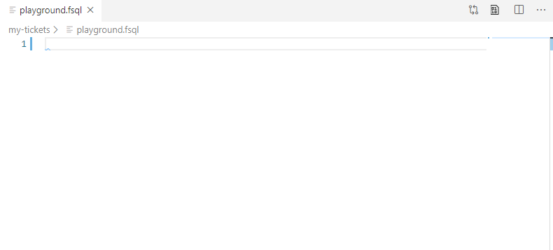
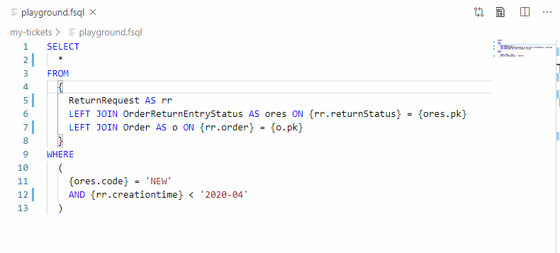

# my-vscode-hybris-tools README

## Features

1. Validate fsql syntax
2. Execute fsql (`F5`)
3. Execute groovy (`F5`)
4. Execute and Commit groovy (`Shift + F5`)
5. Import ImpEx

### Beta

1. Autocompletion for hybris types
2. Autocompletion for hybris type attributes
3. Autocompletion for subqueries
4. fsql Formatter
5. See the definition of a hybris type
6. See the definition of a alias
7. Auto fix actions for `1` as conditions instead of `1 = 1`
8. Convert fsql to sql and fill in parameters

### Screenshots

https://docs.google.com/presentation/d/1dWoE6_gfGKV0wwEU5XDJmwHHoOJiO5BATnyd7NPPLkU/edit#slide=id.p




## Requirements

Please provide a connectable hybris before using the extension.

## Extension Settings

* `vscode-hybris-tools.hac.url`: The URL to the hybris HAC extension.
* `vscode-hybris-tools.hac.username`: The username used for logging in the HAC.
* `vscode-hybris-tools.hac.password`: The password used for logging in the HAC.
* `vscode-hybris-tools.http.timeout`: The HTTP socket timeout.
* `vscode-hybris-tools.http.useStrictSSL`: Use strict SSL.
* `vscode-hybris-tools.offline.typeCodes`: The type codes for offline types autocompletion. e.g. ["HktvVariantProduct", "OfflineType", "HelloWorld"]

```json
{
  "vscode-hybris-tools.hac.url": "https://localhost:9012/hac",
  "vscode-hybris-tools.hac.username": "admin",
  "vscode-hybris-tools.hac.password": "philipsspilihp",
  "vscode-hybris-tools.http.timeout": 10000,
  "vscode-hybris-tools.http.useStrictSSL": false,
  "vscode-hybris-tools.offline.typeCodes": [
    "OfflineCode",
    "VariantProduct"
  ],

  // To have autocompletion in snippets, you need to have this false.
  "editor.suggest.snippetsPreventQuickSuggestions": false
}
```

## Known Issues

Calling out known issues can help limit users opening duplicate issues against your extension.

## Release Notes

Please see `./CHANGELOG.md`.

### For more information

* [Our parser and some sample features](https://github.com/leoiii12/flex-query-parser)
* [vscode-hybris-tools](https://github.com/vscode-hybris-tools/vscode-hybris-tools)
* [FSQL syntax](https://help.sap.com/doc/a4265d5ea8314eb2929e6cf6fb8e35a5/1811/en-US/de/hybris/platform/servicelayer/search/FlexibleSearchService.html)

**Enjoy!**
